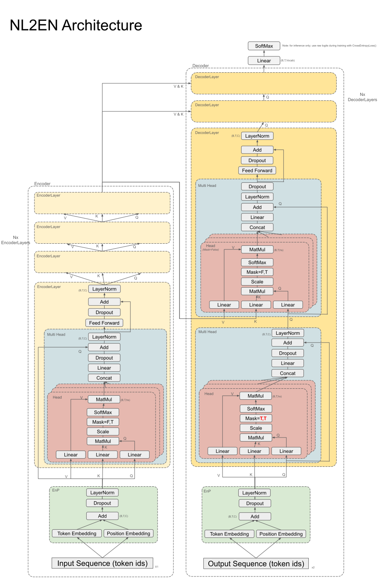

# Encoder/Decoder Tutorial

Learn the fundamentals of the Encoder/Decoder Transformer architecture (the building block of LLMs like ChatGPT) with a working pytorch example that translates Dutch (NL) to English (EN). This example closely follows the transformer architecture of the [Attention is All You Need](https://arxiv.org/abs/1706.03762) paper.

  

- Get started with the interactive Google Colab notebook [**here**](https://colab.research.google.com/drive/1I-IFQvNW-PLEcDT3WeIX0OSgbExYcE6k#scrollTo=6fb3ba33-3de6-468c-a070-04886cb4329a).

  

^ model architecture [here](https://docs.google.com/presentation/d/1sRWV0hxIgL8ZNyrqV_jz7vX5l815RJI5l_KlXoVJHAQ/edit#slide=id.g29d8fe39d9a_0_0)

  

Credit goes to [Tatoeba.org](https://tatoeba.org/en/downloads) for the Dutch <-> English sentence pairs.

  

**Full list of Python Dependencies:**

*Alphabetical order, except primary libraries which are listed first in **bold**.*

| Name | Version |

| --- | ----------- |

| **python** | **3.10.12** |

| **tokenizers** | **0.15.0** |

| **torch** | **2.1.0** |

| **scikit-learn** | **1.3.2** |

| **numpy** | **1.26.2** |

| **pandas** | **1.5.3** |

| asttokens | 2.4.1 |

| beautifulsoup4 | 4.12.2 |

| bzip2 | 1.0.8 |

| ca-certificates | 2023.08.22 |

| certifi | 2023.11.17 |

| charset-normalizer | 3.3.2 |

| colorama | 0.4.6 |

| comm | 0.2.0 |

| contourpy | 1.2.0 |

| cycler | 0.12.1 |

| debugpy | 1.8.0 |

| decorator | 5.1.1 |

| exceptiongroup | 1.2.0 |

| executing | 2.0.1 |

| filelock | 3.13.1 |

| fonttools | 4.46.0 |

| fsspec | 2023.12.1 |

| huggingface-hub | 0.19.4 |

| idna | 3.6 |

| jedi | 0.19.1 |

| jinja2 | 3.1.2 |

| joblib | 1.3.2 |

| kiwisolver | 1.4.5 |

| libffi | 3.4.4 |

| markupsafe | 2.1.3 |

| matplotlib | 3.8.2 |

| matplotlib-inline | 0.1.6 |

| mpmath | 1.3.0 |

| nest-asyncio | 1.5.8 |

| networkx | 3.2.1 |

| openssl | 3.0.12 |

| packaging | 23.2 |

| parso | 0.8.3 |

| pillow | 10.1.0 |

| pip | 23.3.1 |

| platformdirs | 4.1.0 |

| prompt-toolkit | 3.0.41 |

| psutil | 5.9.6 |

| pure-eval | 0.2.2 |

| pygments | 2.17.2 |

| pyparsing | 3.1.1 |

| python-dateutil | 2.8.2 |

| pytz | 2023.3.post1 |

| pywin32 | 306 |

| pyyaml | 6.0.1 |

| pyzmq | 25.1.2 |

| requests | 2.31.0 |

| scipy | 1.11.4 |

| setuptools | 68.0.0 |

| six | 1.16.0 |

| soupsieve | 2.5 |

| sqlite | 3.41.2 |

| stack-data | 0.6.3 |

| sympy | 1.12 |

| threadpoolctl | 3.2.0 |

| tk | 8.6.12 |

| tornado | 6.4 |

| tqdm | 4.66.1 |

| traitlets | 5.14.0 |

| typing-extensions | 4.8.0 |

| tzdata | 2023c |

| urllib3 | 2.1.0 |

| vc | 14.2 |

| vs2015_runtime | 14.27.29016 |

| wcwidth | 0.2.12 |

| wheel | 0.41.2 |

| xz | 5.4.5 |

| zlib | 1.2.13 |